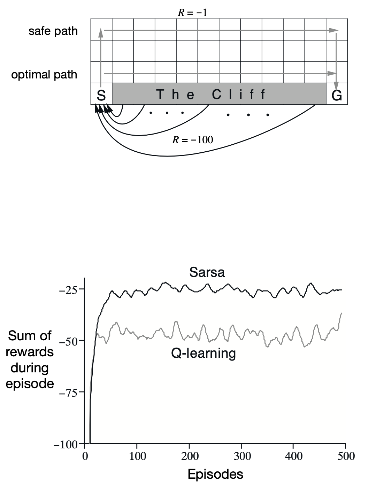
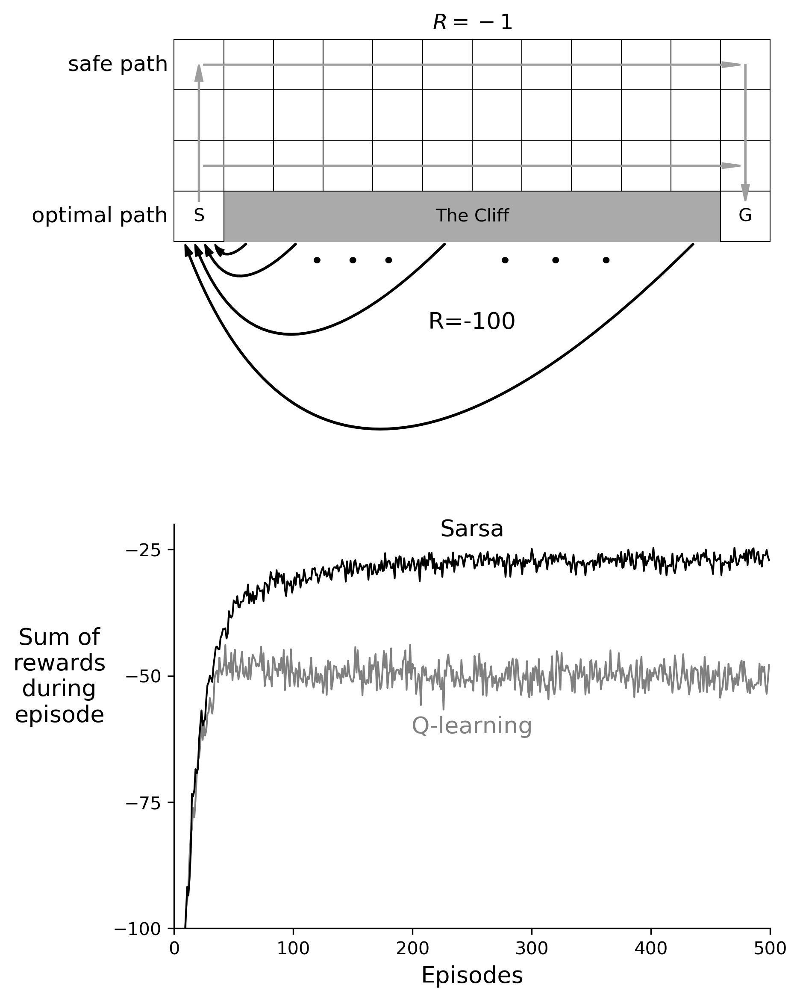

# Implementation for Reinforcement Learning: An Introduction

This project provides a python implementation for all the figures and examples in the book - [Reinforcement Learning: An Introduction (2nd Edition)](http://incompleteideas.net/book/bookdraft2017nov5.pdf).

In the implementation process, some parameters are not mentioned in the book. For the consistency of the figure, these parameters refer to the code from [ShangtongZhang](https://github.com/ShangtongZhang/reinforcement-learning-an-introduction/).

<div align=center>
	
	
    <p><b>Figure:</b> the original (left) and implementation (right)</p>
</div>

All codes are well organized and easy to understand, and can be easily read with formulas and algorithms:
```python
# direct reinforcement learning
Q[S][A] += α * (R + γ * max(Q[S_]) - Q[S][A])

# model learning
self.t += 1
# Actions that had never been tried were allowed to be considered in the planning step
if κ != 0 and (S, A) not in M:
    for a in range(Maze.ACT_NUM):
        M[S, a] = (S, 0, 1)
M[S, A] = (S_, R, self.t)

# planning
for _ in range(self.n):
    S, A = random.choice(list(M.keys()))
    S_, R, t = M[S, A]
    if κ:
        τ = self.t - t
        R += κ * np.sqrt(τ)
    Q[S][A] += α * (R + γ * max(Q[S_]) - Q[S][A])
```