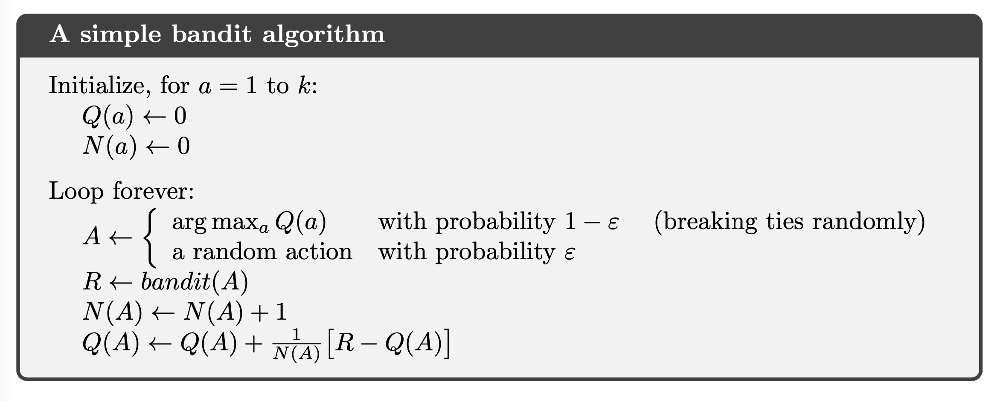
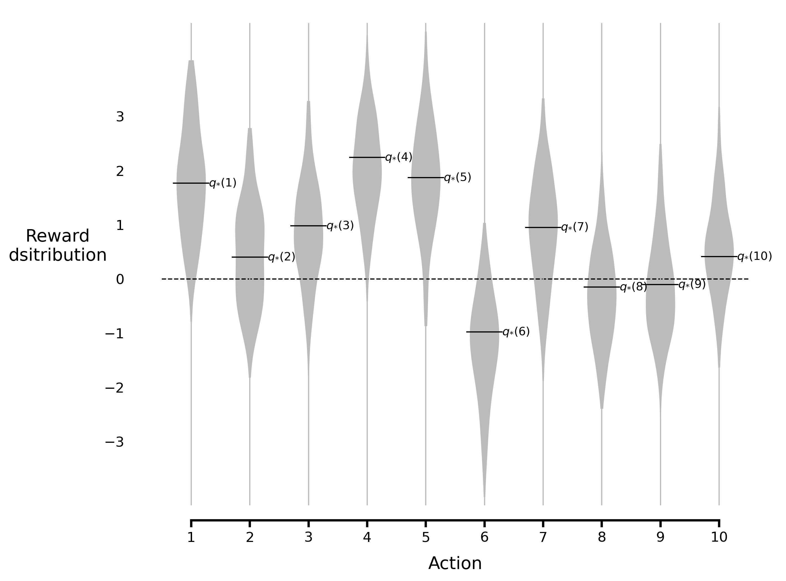
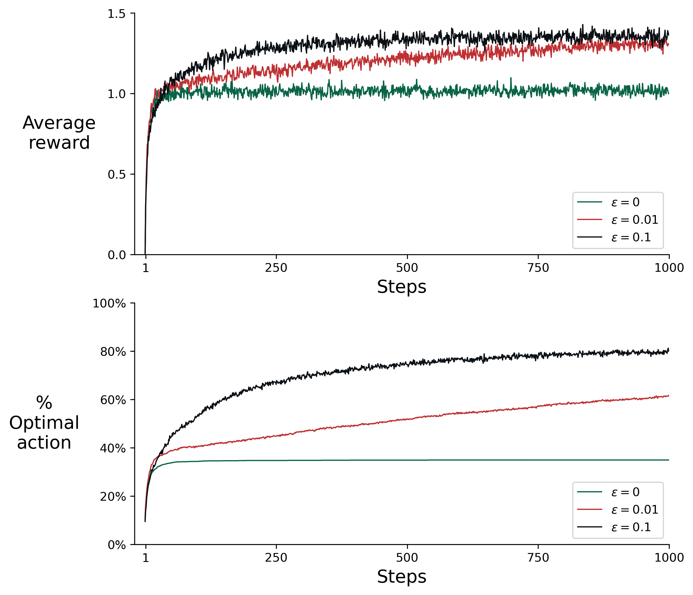
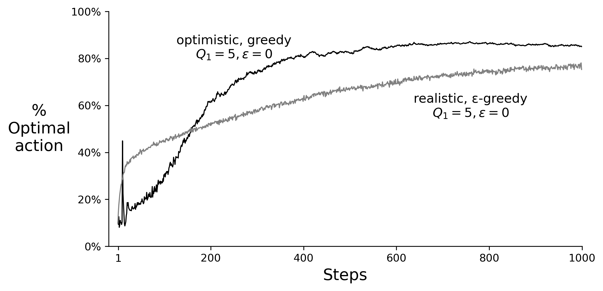
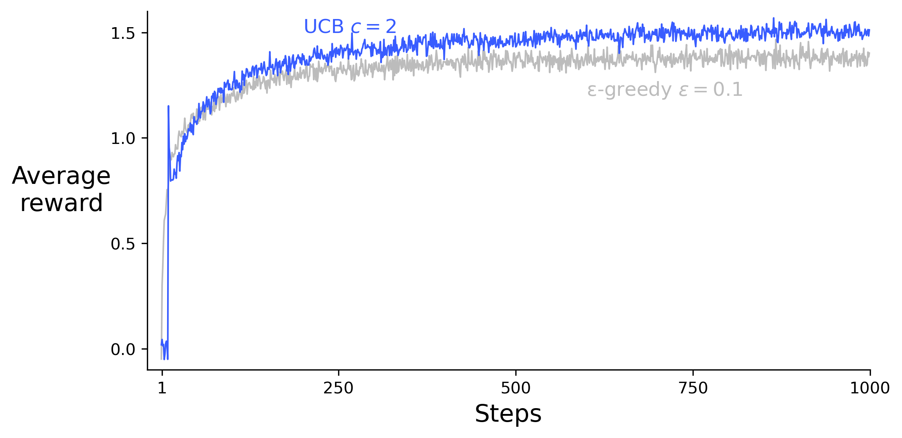
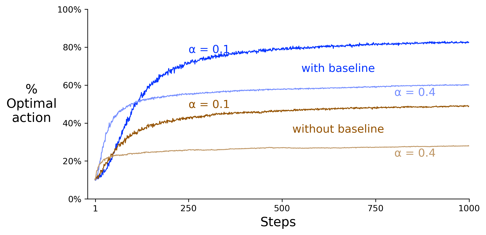
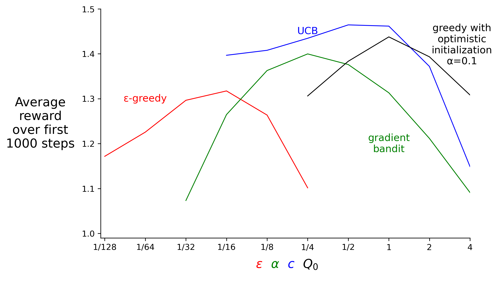

# Chapter 2 Multi-armed Bandits

### Pseudocode

### Figure

**Figure 2.1:** An example bandit problem from the 10-armed testbed. The true value $q_{*}(a)$ of each of the ten actions was selected according to a normal distribution with mean zero and unit variance, and then the actual rewards were selected according to a mean $q_{*}(a)$ unit variance normal distribution, as suggested by these gray distributions.

**Figure 2.2:** Average performance of ε-greedy action-value methods on the 10-armed testbed. These data are averages over 2000 runs with different bandit problems. All methods used sample averages as their action-value estimates.

**Figure 2.3:** The effect of optimistic initial action-value estimates on the 10-armed testbed. Both methods used a constant step-size parameter, α = 0.1.

**Figure 2.4:** Average performance of UCB action selection on the 10-armed testbed. As shown, UCB generally performs better than ε-greedy action selection, except in the first k steps, when it selects randomly among the as-yet-untried actions.

**Figure 2.5:** Average performance of the gradient bandit algorithm with and without a reward baseline on the 10-armed testbed when the $q_{*}(a)$ are chosen to be near +4 rather than near zero.

**Figure 2.6:** A parameter study of the various bandit algorithms presented in this chapter. Each point is the average reward obtained over 1000 steps with a particular algorithm at a particular setting of its parameter.