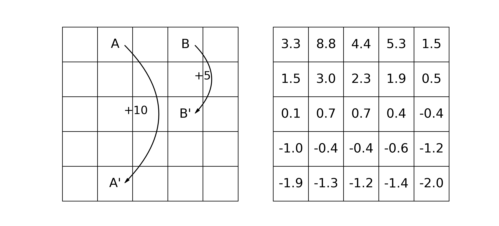
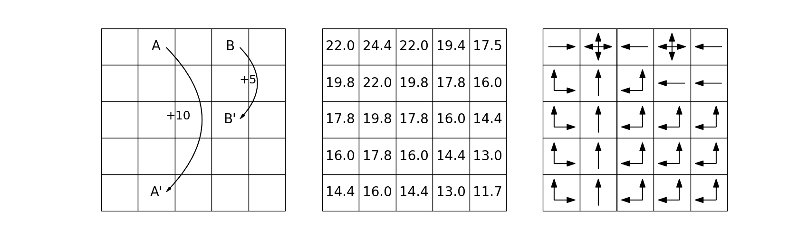

# Chapter 3 Finite Markov Decision Processes

### Figure

**Figure 3.2:** Gridworld example: exceptional reward dynamics (left) and state-value function for the equiprobable random policy (right).

**Figure 3.5:** Optimal solutions to the gridworld example.