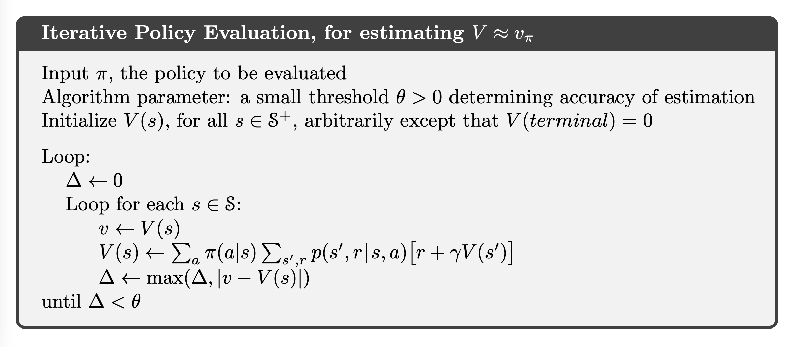
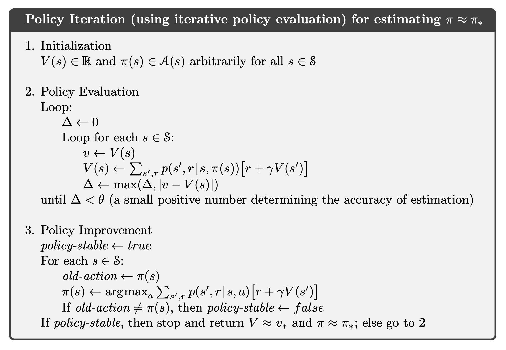
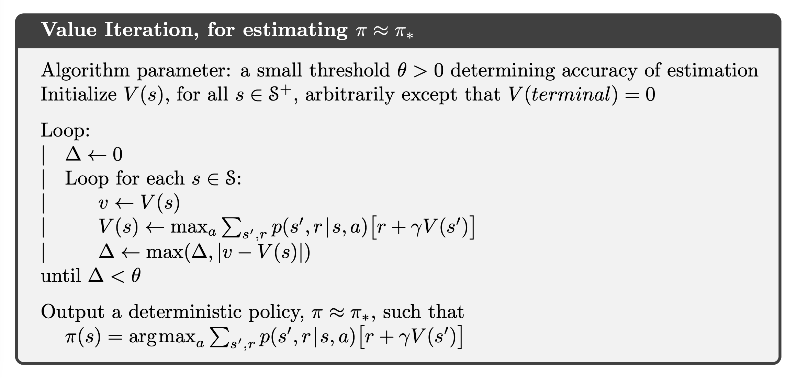
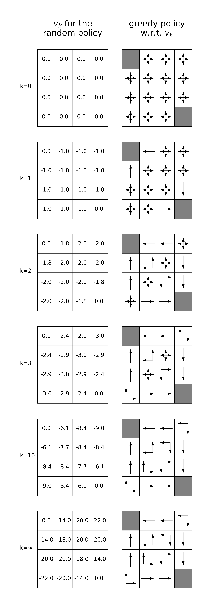
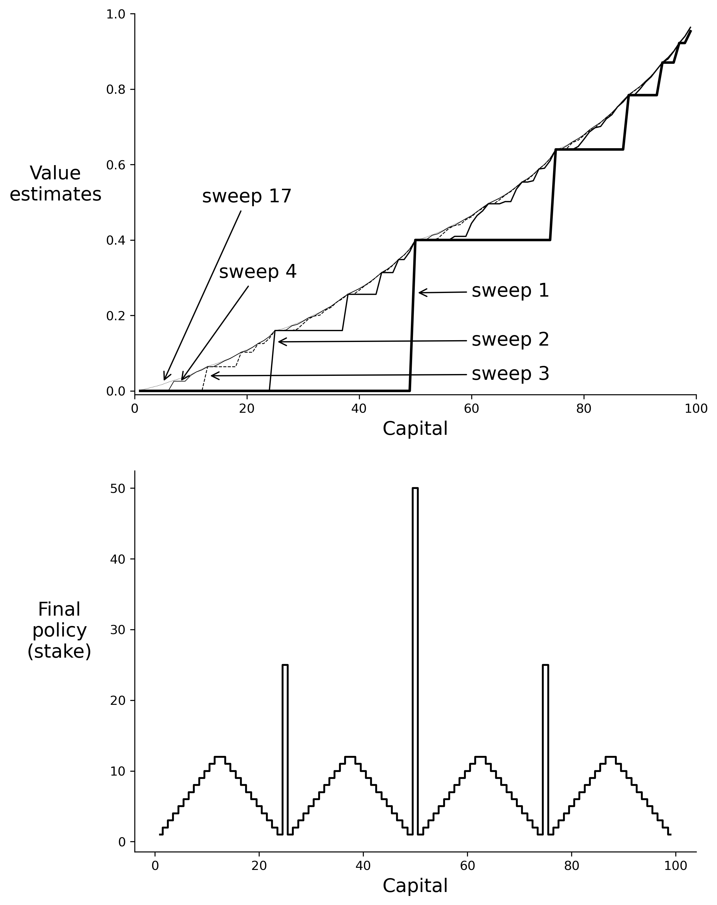

# Chapter 4 Dynamc Programming

### Pseudocode

### Figure

**Figure 4.1:** Convergence of iterative policy evaluation on a small gridworld. The left column is the sequence of approximations of the state-value function for the random policy (all actions equal). The right column is the sequence of greedy policies corresponding to the value function estimates (arrows are shown for all actions achieving the maximum). The last policy is guaranteed only to be an improvement over the random policy, but in this case it, and all policies after the third iteration, are optimal.

**Figure 4.2:** The sequence of policies found by policy iteration on Jack’s car rental problem, and the final state-value function. The first five diagrams show, for each number of cars at each location at the end of the day, the number of cars to be moved from the first location to the second (negative numbers indicate transfers from the second location to the first). Each successive policy is a strict improvement over the previous policy, and the last policy is optimal.

**Figure 4.3:** The solution to the gambler’s problem for ph = 0.4. The upper graph shows the value function found by successive sweeps of value iteration. The lower graph shows the final policy.