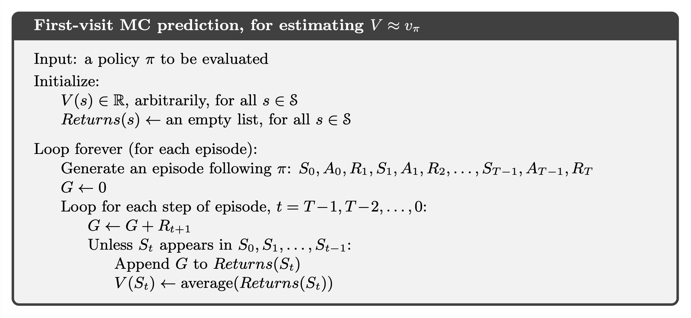
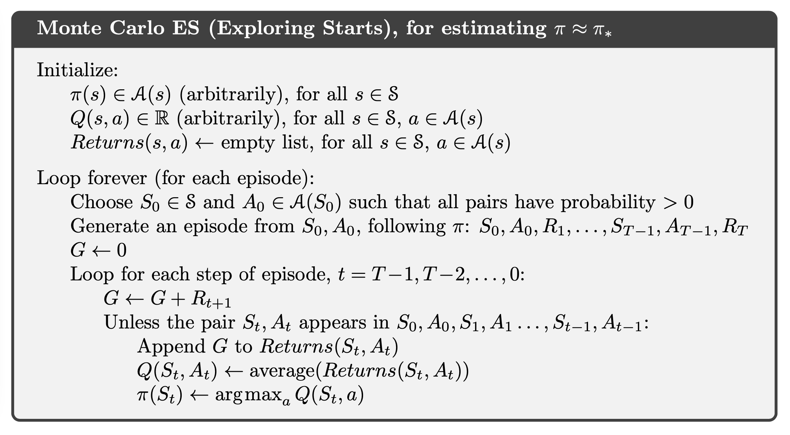
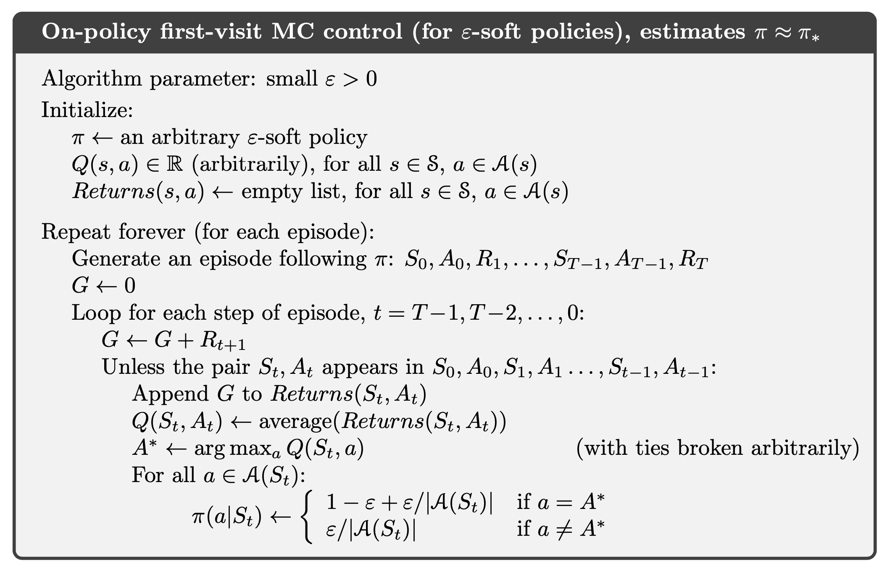
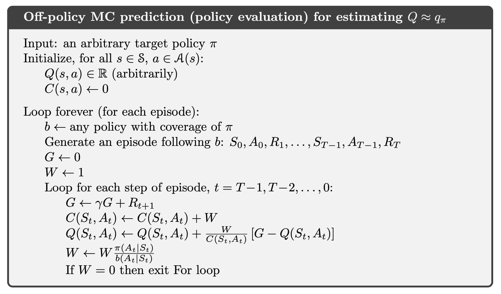
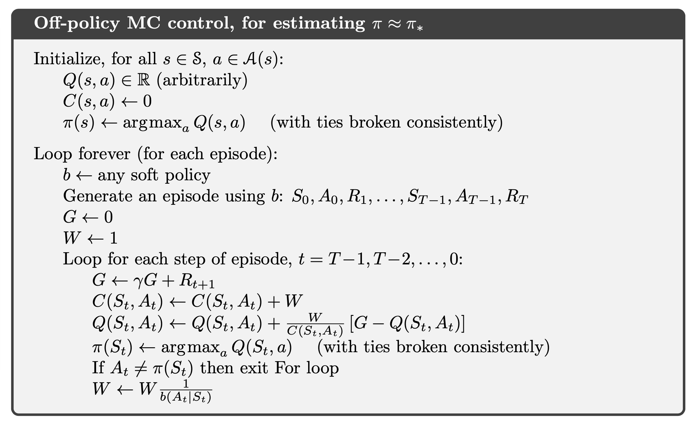
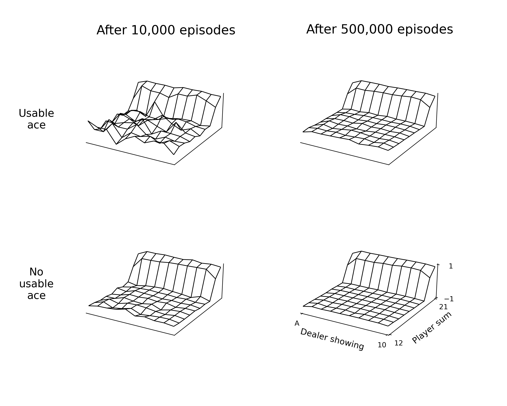
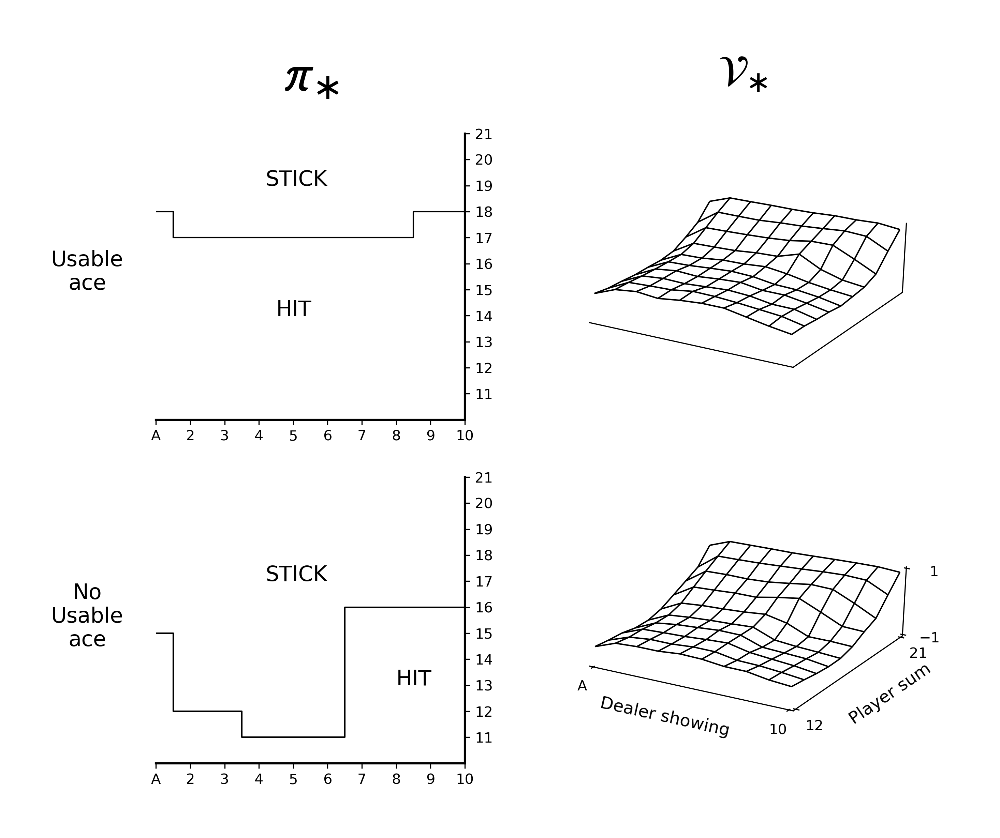
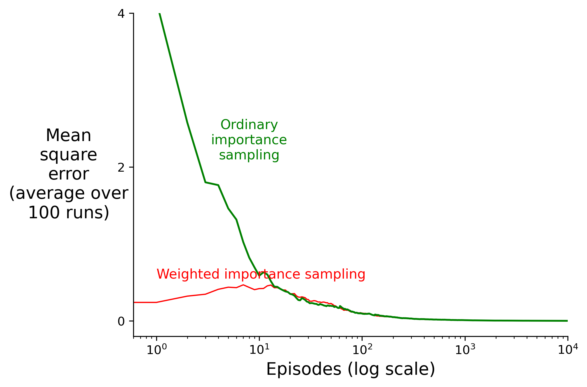
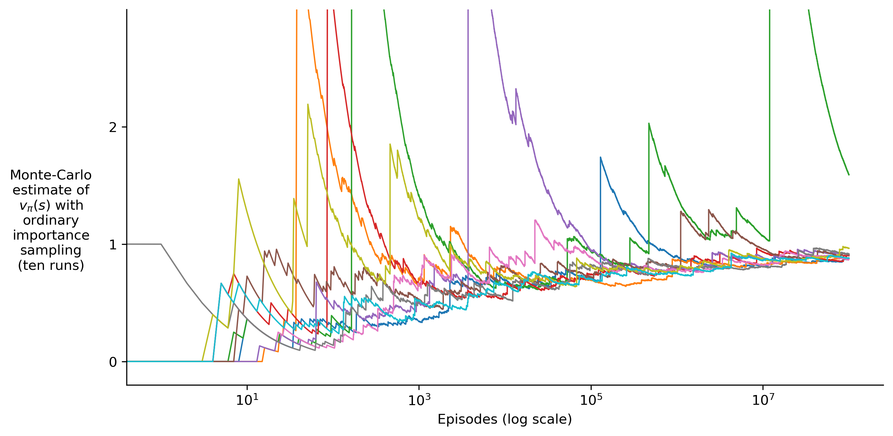

# Chapter 5 Monte Carlo Methods

### Pseudocode

### Figure

**Figure 5.1:** Approximate state-value functions for the blackjack policy that sticks only on 20 or 21, computed by Monte Carlo policy evaluation.

Figure 5.2: The optimal policy and state-value function for blackjack, found by Monte Carlo ES. The state-value function shown was computed from the action-value function found by Monte Carlo ES.

Figure 5.3: Weighted importance sampling produces lower error estimates of the value of a single blackjack state from off-policy episodes (see Example 5.3).

Figure 5.4: Ordinary importance sampling produces surprisingly unstable estimates on the one-state MDP shown inset (Example 5.5). The correct estimate here is 1 (γ = 1), and, even though this is the expected value of a sample return (after importance sampling), the variance of the samples is infinite, and the estimates do not converge to this value. These results are for off-policy first-visit MC.