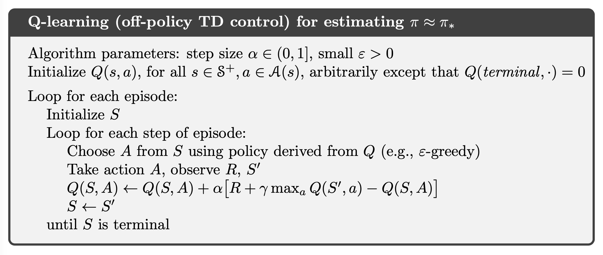

# Chapter 6 Temporal-Difference Learning

### Pseudocode
_estimating.png)

### Figure

**Example 6.2:** Random Walk

**Figure 6.2:** Performance of TD(0) and constant-α MC under batch training on the random walk task.

**Example 6.5:** Windy Gridworld

**Example 6.6:** Cliff Walking

**Figure 6.3:** Interim and asymptotic performance of TD control methods on the cliff-walking task as a function of α. All algorithms used an ε-greedy policy with ε = 0.1. Asymptotic performance is an average over 100,000 episodes whereas interim performance is an average over the first 100 episodes. These data are averages of over 50,000 and 10 runs for the interim and asymptotic cases respectively. The solid circles mark the best interim performance of each method. Adapted from van Seijen et al. (2009).

**Figure 6.5:** Comparison of Q-learning and Double Q-learning on a simple episodic MDP (shown inset). Q-learning initially learns to take the left action much more often than the right action, and always takes it significantly more often than the 5% minimum probability enforced by ε-greedy action selection with ε = 0.1. In contrast, Double Q-learning is essentially unaffected by maximization bias. These data are averaged over 10,000 runs. The initial action-value estimates were zero. Any ties in ε-greedy action selection were broken randomly.
