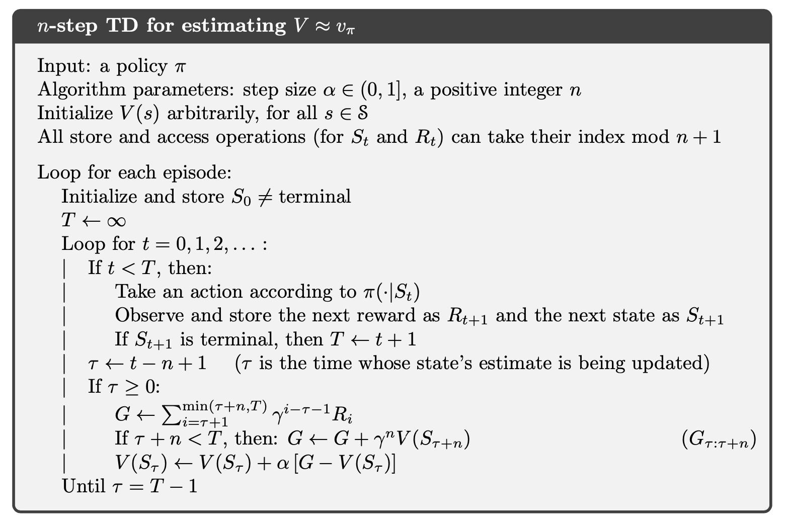
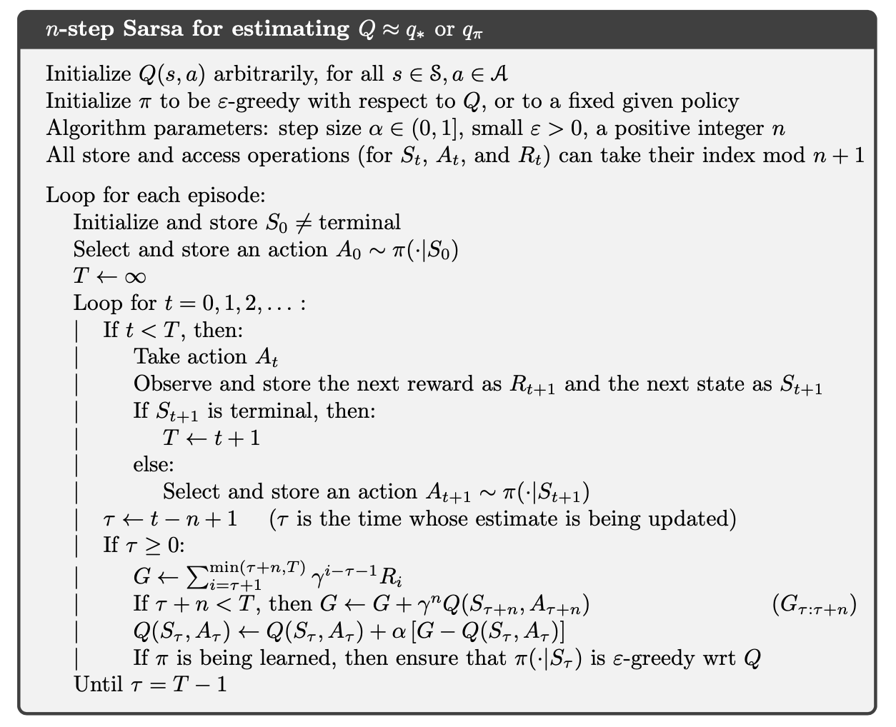
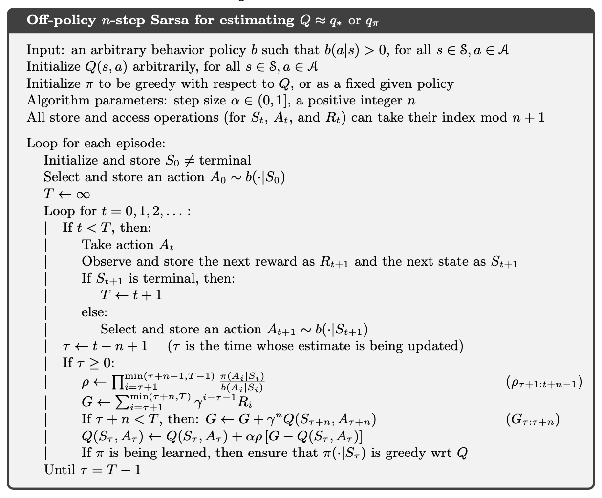
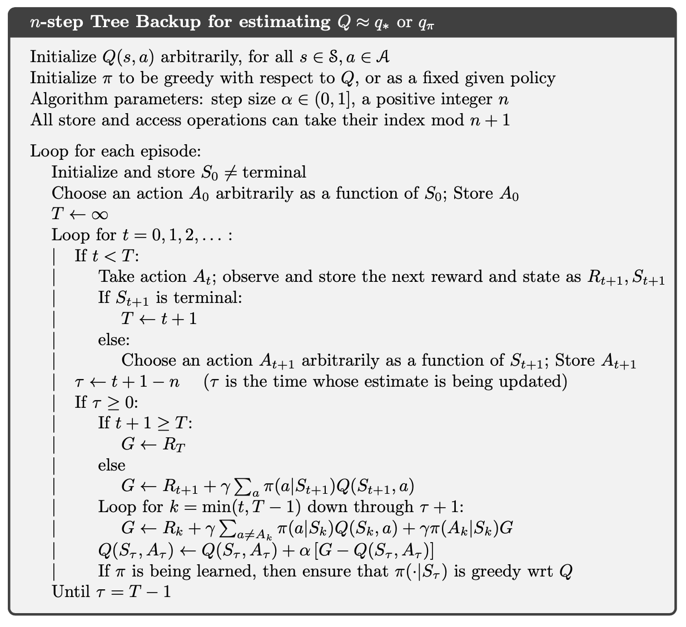
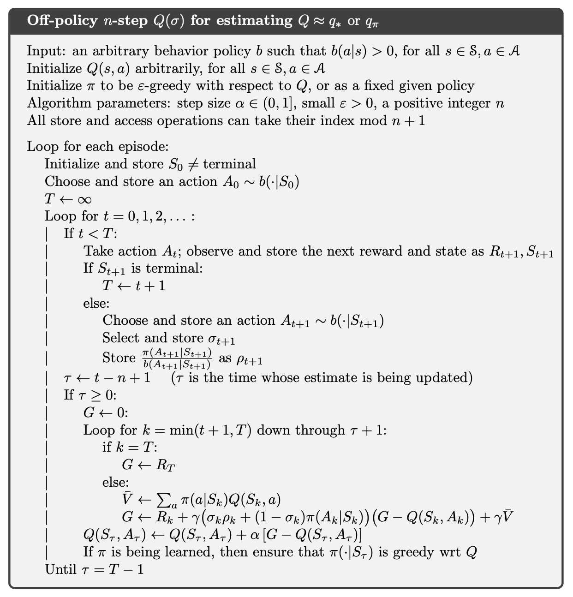
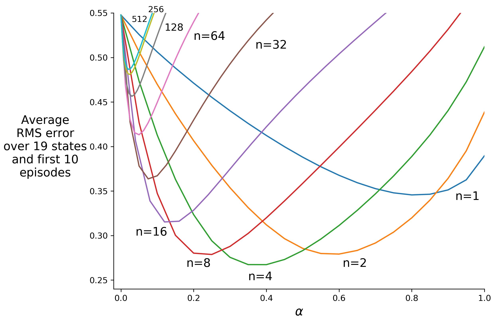

# Chapter 7 n-step Bootstrapping

### Pseudocode

### Figure

**Figure 7.2:** Performance of n-step TD methods as a function of α, for various values of n, on a 19-state random walk task (Example 7.1).