# Chapter 8 Planning and Learning with Tabular Methods

### Pseudocode
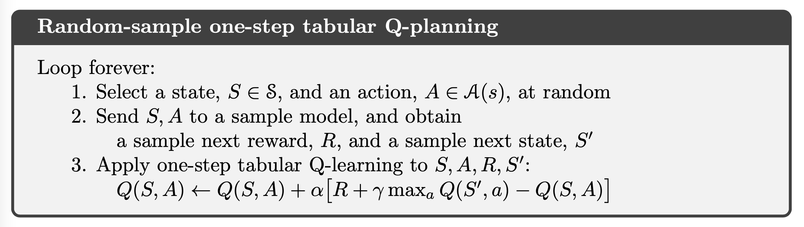

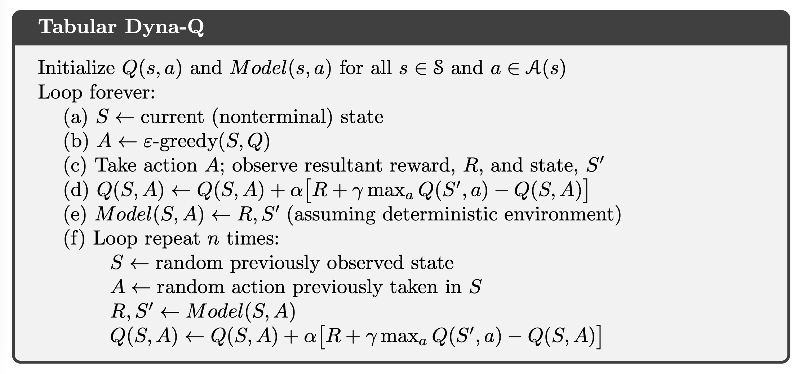

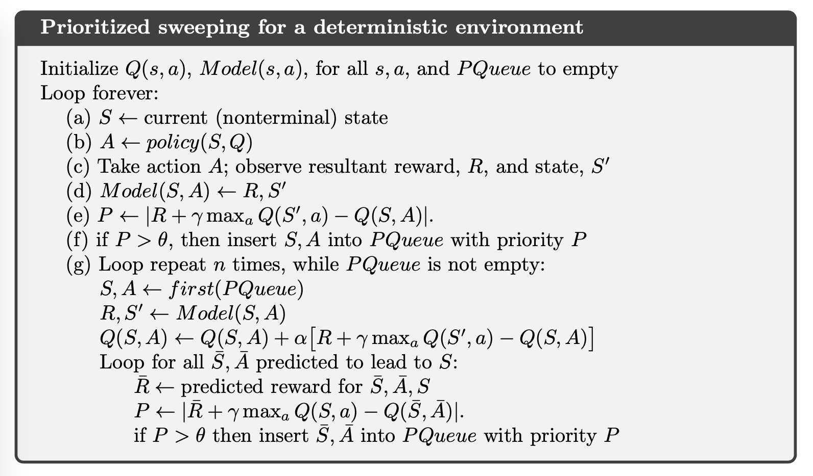

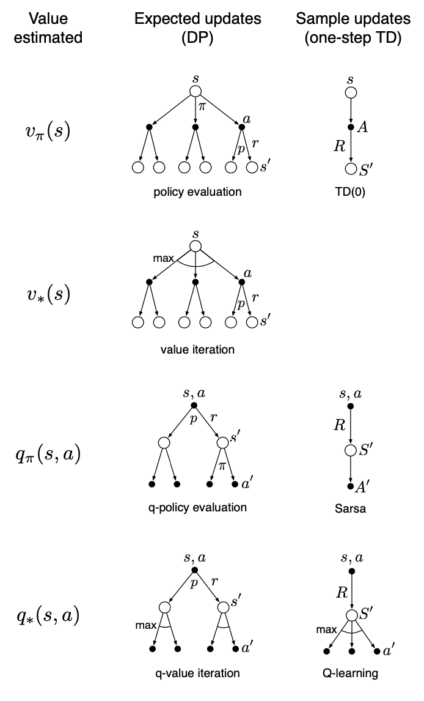

### Figure
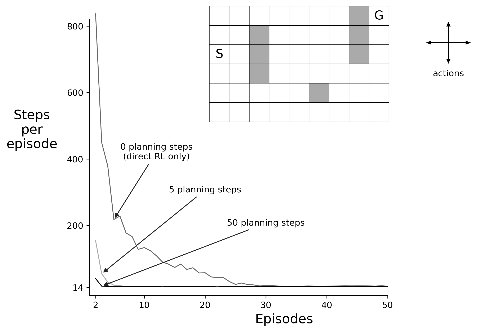
**Figure 8.2:** A simple maze (inset) and the average learning curves for Dyna-Q agents varying in their number of planning steps (n) per real step. The task is to travel from S to G as quickly as possible.

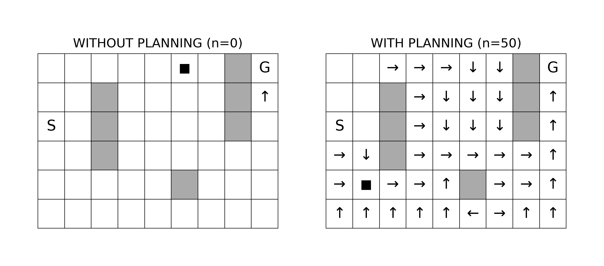
**Figure 8.3:** Policies found by planning and nonplanning Dyna-Q agents halfway through the second episode. The arrows indicate the greedy action in each state; if no arrow is shown for a state, then all of its action values were equal. The black square indicates the location of the agent.

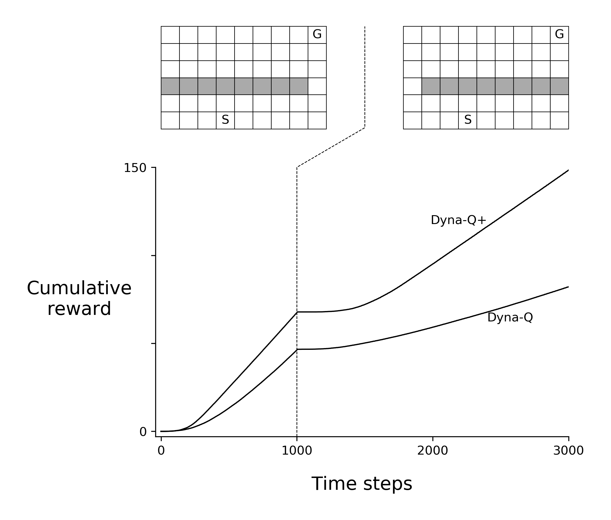
**Figure 8.4:** Average performance of Dyna agents on a blocking task. The left environment was used for the first 1000 steps, the right environment for the rest. Dyna-Q+ is Dyna-Q with an exploration bonus that encourages exploration.

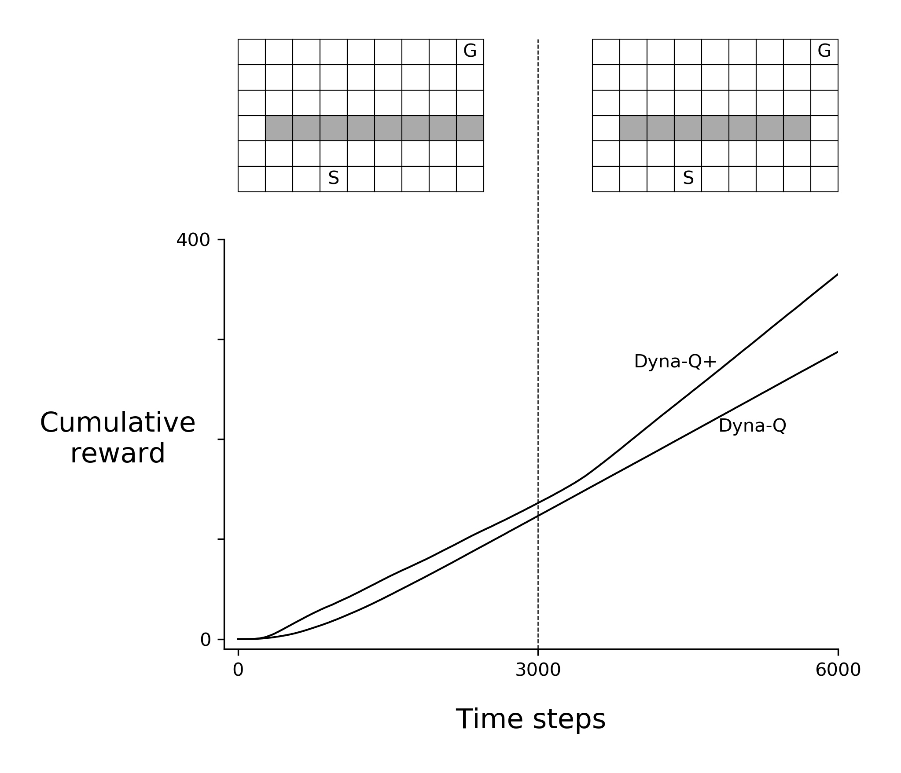
**Figure 8.5:** Average performance of Dyna agents on a shortcut task. The left environment was used for the first 3000 steps, the right environment for the rest.

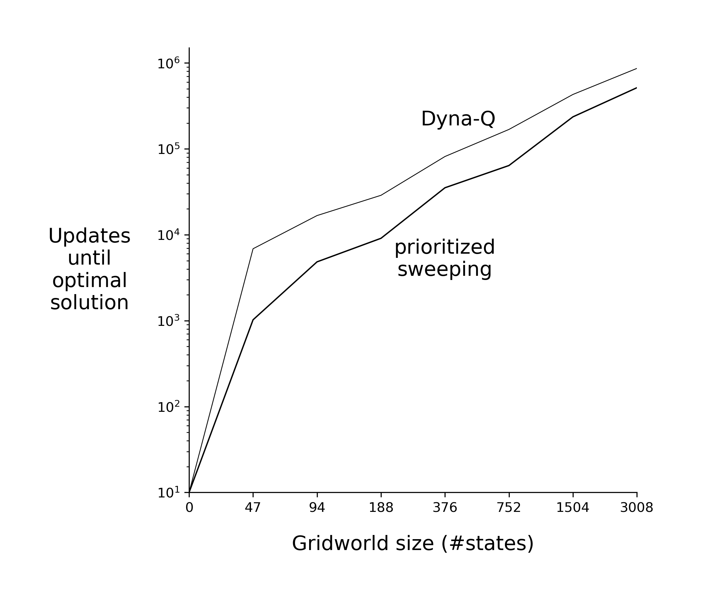
**Example 8.4:** Prioritized Sweeping on Mazes

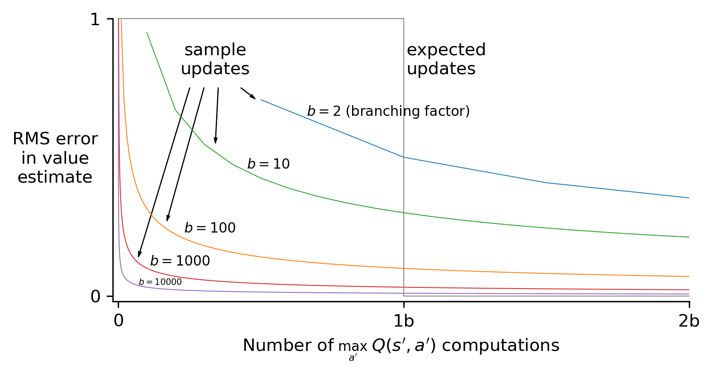
**Figure 8.7:** Comparison of efficiency of expected and sample updates.

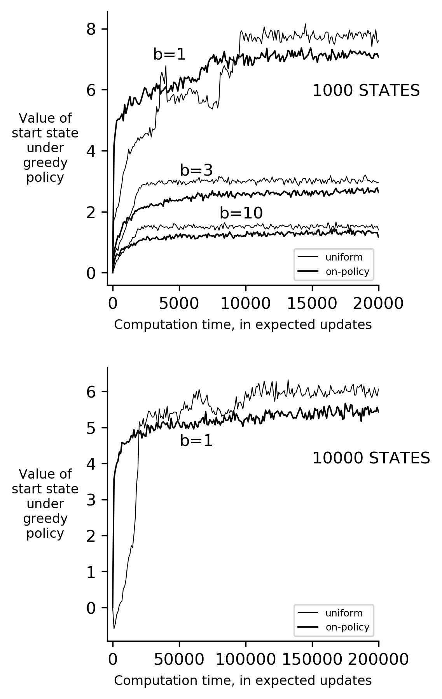
**Figure 8.8:** Relative efficiency of updates distributed uniformly across the state space versus focused on simulated on-policy trajectories, each starting in the same state. Results are for randomly generated tasks of two sizes and various branching factors, b.